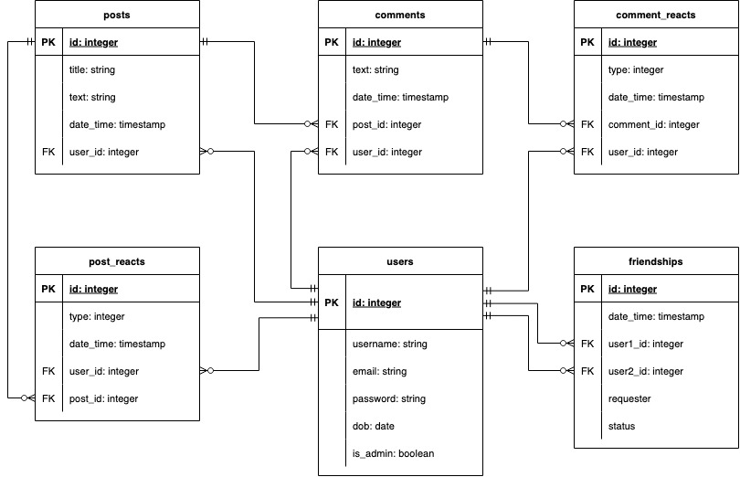

# Social Media RESTFUL API

## R1: Identification of the problem you are trying to solve by building this particular app.
This backend API serves as the foundation for a social media application. This app allows users to connect with their friends online and share content. These features help solve various problems for the app’s users. For instance, it helps fulfil their need for acquiring new knowledge and their need to socialise and feel connected to others.

## R2: Why is it a problem that needs solving?
When these needs are not being met, it creates a problem for individuals, as they each have a large impact on a person’s overall mood. For instance, socialisation and feeling connected to others has a proven link to increased dopamine and other feel good hormones. Likewise, many people have a thirst for acquiring new knowledge, as it stimulates the brain, allows people to better themselves and is an overall rewarding process. Therefore, if your product is able to provide socialisation and a means for acquiring new knowledge to people who otherwise would have gone without those things, you are effectively solving a large problem for them and these people will naturally gravitate towards your product. This theory has been proven with the sheer popularity of social media and content sharing platforms such as Facebook, Twitter and TikTok who help people meet those needs. However, recent events show that these companies aren’t bullet proof. The tech world moves quick, and Twitter and Meta appear to be on a downwards trajectory. This social media API serves as the foundation for an app that can potentially expand in numerous directions later on. If quality features continue to be added, it could potentially fill a void if one of these social media giants collapses. Alternatively, I could look at targeting a smaller, more niche community to avoid some of the competition.

## R3: Why have you chosen this database system. What are the drawbacks compared to others?
When creating a backend API, one of the biggest questions that needs answering is which database management system to use. Before you can answer this, you first have to decide whether to use an SQL or a NoSQL database system. NoSQL databases have their use cases, particularly when dealing with large amounts of unstructured and unrelated data. However, for this social media app, the data is highly related. For instance, every comment that is created will be linked to a post and to a user. Therefore, it makes more sense to use a relational database management system. Using an SQL database also allows us to create a standardised scheme of linked tables, which does make the data more rigid but it also improves data integrity and consistency, which I have placed at a premium. Additionally, some relational database management systems allow you to access NoSQL features as well if the use case arises, which provides even more reason to use a relational database management system. With that sorted, the next big question that needs answering is what RDBMS to use. MySQL and PostgreSQL are at the forefront of the industry when it comes to RDBMS. Before I could choose between the two, I had to weigh up the advantages and disadvantages of each while taking into account the needs of my social media app. The main advantage of MySQL is that it has a more minimalistic approach, and as such, provides superior speed for some certain database operations. PostgreSQL, on the other hand, takes the opposite approach, opting to provide more extensive functionality with the trade off of slower speeds for some certain operations. Some of this functionality includes support for user defined custom functions, complex data types (such as arrays and geographic data), more extensive SQL syntax, NoSQL features and additional join options. The backend API being implemented is supposed to serve as an initial foundation for a social media app which can be extended in many different directions later on if need be. Currently, the API is relatively simple and small scale, and doesn’t have a use case for most of PostgreSQL’s extended functionality on offer. As such, MySQL would seem like the better option on paper, so that the API can benefit from its slightly better performance. However, I’ve chosen PostgreSQL as the RDBMS for the API for a few reasons. Firstly, I’m anticipating that the API might grow in scope and complexity later on, and in such a scenario, this would lead to a number of use cases for PostgreSQL’s extended functionality. As the API becomes more complex, so would the queries, and PostgreSQL has been shown to have excellent performance for complex queries. Additional factors that influenced the decision to use PostgreSQL include its highly regarded documentation and the fact that it seems to be moving fast in regards to development. The fact that I have more experience working with PostgreSQL databases compared to MySQL databases also influenced the decision. Although MySQL might make the most sense for the current state of the app, it’s important to anticipate future needs, and PostgreSQL wins out when taking this into consideration.

## R4: Identify and discuss the key functionalities and benefits of an ORM
A layer of abstraction that sits between an object-oriented programming language and a relational database. It maps objects created in the programming language to the tables in a relational database. Can use your programming language of choice to query and manipulate the database rather than SQL. The imported ORM provides an interface allowing you to create models that each represent a table in the relational database. These models and the provided interface encapsulate pre-existing code that can be accessed through methods and allow you to access the database and manipulate it. When using these methods to query the database, behind the scenes, it automatically takes care of connecting to the database, converting your code into SQL queries, querying the database, and then converting and storing the query result in a data structure native to the programming language using the ORM. 

ORMs are so widely adopted in industry as they offer a number of benefits over using raw SQL. One of the biggest advantages of ORMs is that in a single method call, it can handle connecting to the database, sanitising any input (preventing SQL injection), generating the SQL, querying the database and fetching the result. This makes the code far less complex and also faster to write. This helps improve the maintainability of the codebase and increases development speed, which ultimately leads to less development cost. Another benefit of ORMs is that they are inherently DRY (‘Don’t Repeat Yourself), as you only have to define models once, and these can be used to automatically generate repetitive SQL code which you don’t have to deal with. Another key advantage is that all the boilerplate code encapsulated in the ORM library’s interface is well-tested, as most ORMs are open-sourced and extensively used in industry by highly-skilled developers, which means any bugs that pop up will be quickly identified and fixed. Additionally, ORMs tend to follow known design patterns and well-thought out code templates. This promotes consistency and readability across a project’s codebase, even with multiple developers. 

## R5: Document all endpoints for your API
### Create User
- Endpoint: /auth/register
- HTTP Verb: POST
- Required data: JSON object in body containing username (string), email (email), password (string), dob (date) and is_admin (boolean). Password needs to be 7 characters minimum and the dob must follow the “DD/MM/YYYY” format. 
- Response data: A JSON object in the response body containing the created user object (id, username, email, dob, is_admin) and a JWT token.

### Login
- Endpoint: /auth/login
- HTTP Verb: POST
- Required data: JSON object in body containing username (string) and password (string)
- Response data: A JSON object in the response body containing the created user object (id, username, email, dob, is_admin) and a JWT token.

### Read All Users
- Endpoint: /users
- HTTP Verb: GET
- Authentication/Authorisation: Must provide valid JWT token in bearer token
- Required data: None
- Response data: A JSON object in the response body containing a list of user objects (id, username, email, dob, is_admin)

### Read Single User
- Endpoint: /users/<user_id>
- HTTP Verb: GET
- Authentication/Authorisation: Must provide valid JWT token in bearer token
- Required data: A user id value in the URI endpoint as a path parameter
- Response data: A JSON object in the response body containing a user object (id, username, email, dob, is_admin)

### Update User
- Endpoint: /users/<user_id>
- HTTP Verb: PUT, PATCH
- Authentication/Authorisation: Must provide valid JWT token in bearer token. Must be logged in as the user that is being updated. 
- Required data: A user id value in the URI endpoint as a path parameter. JSON object in body containing username (string), email (email), password (string), dob (date) and is_admin (boolean). Password needs to be 7 characters minimum and the dob must follow the “DD/MM/YYYY” format. Each of these attributes are optional to include. 
- Response data: A JSON object in the response body containing a user object (id, username, email, dob, is_admin)

### Delete User
- Endpoint: /users/<user_id>
- HTTP Verb: DELETE
- Authentication/Authorisation: Must provide valid JWT token in bearer token. Must be logged in as the user that is being updated or be logged in as an admin user.
- Required data: A user id value in the URI endpoint as a path parameter
- Response data: Success message in a JSON object

### Read All Posts
– Endpoint: /posts
– HTTP Verb: GET
– Authentication/Authorisation: Must provide valid JWT token in bearer token
– Required data: None
– Response data: A JSON object in the response body containing a list of post objects (id, title, text, date_time, user_id)

### Read Single Post
- Endpoint: /posts/<post_id>
- HTTP Verb: GET
- Authentication/Authorisation: Must provide valid JWT token in bearer token
- Required data: A post id value in the URI endpoint as a path parameter
- Response data: A JSON object in the response body containing a post object (id, title, text, date_time, user_id)

### Create Post
- Endpoint: /posts
- HTTP Verb: POST
- Authentication/Authorisation: Must provide valid JWT token in bearer token
- Required data: A JSON object in the request body containing title (string) and text (string). The title must be within 1 and 150 characters and the text must be within 1 and 400 characters
- Response data: A JSON object in the response body containing the created post object (id, title, text, date_time, user_id)

### Update Post
- Endpoint: /posts/<post_id>
- HTTP Verb: PUT, PATCH
- Authentication/Authorisation: Must provide valid JWT token in bearer token. Must be logged in as the user who created the post.
- Required data: A post id value in the URI endpoint as a path parameter. A JSON object in the request body containing title (string) and text (string). The title must be within 1 and 150 characters and the text must be within 1 and 400 characters. Both attributes are optional to include. 
- Response data: A JSON object in the response body containing the created post object (id, title, text, date_time, user_id)

### Delete Post
- Endpoint: /posts/<posts_id>
- HTTP Verb: DELETE
- Authentication/Authorisation: Must provide valid JWT token in bearer token. Must be logged in as the user that created the post or be logged in as an admin user.
- Required data: A post id value in the URI endpoint as a path parameter
- Response data: Success message in a JSON object

### Read All Comments
- Endpoint: /posts/<post_id>/comments
- HTTP Verb: GET
- Authentication/Authorisation: Must provide valid JWT token in bearer token
- Required data: A post id value in the URI endpoint as a path parameter
- Response data: A JSON object in the response body containing a list of comment objects (id, text, date_time, user_id, post_id)

### Read Single Comment
- Endpoint: /posts/<post_id>/comments/<comment_id>
- HTTP Verb: GET
- Authentication/Authorisation: Must provide valid JWT token in bearer token
- Required data: A post id value in the URI endpoint as a path parameter. A comment id value in the URI endpoint as a path parameter.
- Response data: A JSON object in the response body containing a comment object (id, text, date_time, user_id, post_id)

### Create Comment
- Endpoint: /posts/<post_id>/comments
- HTTP Verb: POST
- Authentication/Authorisation: Must provide valid JWT token in bearer token
- Required data: A post id value in the URI endpoint as a path parameter. A JSON object in the request body containing text (string). The text must be within 1 and 400 characters. 
- Response data: A JSON object in the response body containing the created comment object (id, text, date_time, user_id, post_id)

### Update Comment
- Endpoint: /posts/<post_id>/comments/<comment_id>
- HTTP Verb: PUT, PATCH
- Authentication/Authorisation: Must provide valid JWT token in bearer token. Must be logged in as the user who created the comment.
- Required data: A post id value in the URI endpoint as a path parameter. A comment id value in the URI endpoint as a path parameter. A JSON object in the request body containing text (string). The text must be within 1 and 400 characters. 
- Response data: A JSON object in the response body containing the comment object (id, text, date_time, user_id, post_id)

### Delete Comment
- Endpoint: /posts/<post_id>/comments/<comment_id>
- HTTP Verb: DELETE
- Authentication/Authorisation: Must provide valid JWT token in bearer token. Must be logged in as the user that created the comment or be logged in as an admin user.
- Required data: A post id value in the URI endpoint as a path parameter. A comment id value in the URI endpoint as a path parameter.
- Response data: Success message in a JSON object

### Read All Comment Reacts
- Endpoint: /posts/<post_id>/comments/<comment_id>/reacts
- HTTP Verb: GET
- Authentication/Authorisation: Must provide valid JWT token in bearer token
- Required data: A post id value in the URI endpoint as a path parameter. A comment id value in the URI endpoint as a path parameter.
- Response data: A JSON object in the response body containing a list of comment react objects (id, type, date_time, user_id, comment_id)

### Read Single Comment React
- Endpoint: /posts/<post_id>/comments/<comment_id>/reacts/<comment_react_id>
- HTTP Verb: GET
- Authentication/Authorisation: Must provide valid JWT token in bearer token
- Required data: A post id value in the URI endpoint as a path parameter. A comment id value in the URI endpoint as a path parameter. A comment react id value in the URI endpoint as a path parameter
- Response data: A JSON object in the response body containing a comment react object (id, type, date_time, user_id, comment_id)

### Create Comment React
- Endpoint: /posts/<post_id>/comments/<comment_id>/reacts
- HTTP Verb: POST
- Authentication/Authorisation: Must provide valid JWT token in bearer token
- Required data: A post id value in the URI endpoint as a path parameter. A comment id value in the URI endpoint as a path parameter. A JSON object in the request body containing type (integer). The type attribute must be within the range of 1, 5. 
- Response data: A JSON object in the response body containing the created comment react object (id, type, date_time, user_id, comment_id)

### Update Comment React
- Endpoint: /posts/<post_id>/comments/<comment_id>/reacts/<comment_react_id>
- HTTP Verb: PUT, PATCH
- Authentication/Authorisation: Must provide valid JWT token in bearer token. Must be logged in as the user who created the comment react.
- Required data: A post id value in the URI endpoint as a path parameter. A comment id value in the URI endpoint as a path parameter. A comment react id value in the URI endpoint as a path parameter. A JSON object in the request body containing type (integer). The type attribute must be within the range of 1, 5. 
- Response data: A JSON object in the response body containing the comment react object (id, type, date_time, user_id, comment_id)

### Delete Comment React
- Endpoint: /posts/<post_id>/comments/<comment_id>/reacts/<comment_react_id>
- HTTP Verb: DELETE
- Authentication/Authorisation: Must provide valid JWT token in bearer token. Must be logged in as the user that created the comment react or be logged in as an admin user.
- Required data: A post id value in the URI endpoint as a path parameter. A comment id value in the URI endpoint as a path parameter. A comment react id value in the URI endpoint as a path parameter.
- Response data: Success message in a JSON object

### Read All Post Reacts
- Endpoint: /posts/<post_id>/reacts
- HTTP Verb: GET
- Authentication/Authorisation: Must provide valid JWT token in bearer token
- Required data: A post id value in the URI endpoint as a path parameter. 
- Response data: A JSON object in the response body containing a list of post react objects (id, type, date_time, user_id, post_id)

### Read Single Post React
- Endpoint: /posts/<post_id>/reacts/<post_react_id>
- HTTP Verb: GET
- Authentication/Authorisation: Must provide valid JWT token in bearer token
- Required data: A post id value in the URI endpoint as a path parameter. A post react id value in the URI endpoint as a path parameter.
- Response data: A JSON object in the response body containing a post react object (id, type, date_time, user_id, post_id)

### Create Post React
- Endpoint: /posts/<post_id>/reacts
- HTTP Verb: POST
- Authentication/Authorisation: Must provide valid JWT token in bearer token
- Required data: A post id value in the URI endpoint as a path parameter. A JSON object in the request body containing type (integer). The type attribute must be within the range of 1, 5. 
- Response data: A JSON object in the response body containing the created post react object (id, type, date_time, user_id, post_id)

### Update Post React
- Endpoint: /posts/<post_id>/reacts/<post_react_id>
- HTTP Verb: PUT, PATCH
- Authentication/Authorisation: Must provide valid JWT token in bearer token. Must be logged in as the user who created the post react.
- Required data: A post id value in the URI endpoint as a path parameter. A post react id value in the URI endpoint as a path parameter. A JSON object in the request body containing type (integer). The type attribute must be within the range of 1, 5. 
- Response data: A JSON object in the response body containing the post react object (id, type, date_time, user_id, post_id)

### Delete Post React
- Endpoint: /posts/<post_id>/reacts/<post_react_id>
- HTTP Verb: DELETE
- Authentication/Authorisation: Must provide valid JWT token in bearer token. Must be logged in as the user that created the post react or be logged in as an admin user.
- Required data: A post id value in the URI endpoint as a path parameter. A post react id value in the URI endpoint as a path parameter.
- Response data: Success message in a JSON object

### Read All Friendships
- Endpoint: /users/<user_id>/friendships
- HTTP Verb: GET
- Authentication/Authorisation: Must provide valid JWT token in bearer token
- Required data: A user id value in the URI endpoint as a path parameter. 
- Response data: A JSON object in the response body containing a list of friendship objects (id, date_time, user1_id, user2_id, requester, status)

### Read Single Friendship
- Endpoint: /users/<user_id>/friendships/<friendship_id>
- HTTP Verb: GET
- Authentication/Authorisation: Must provide valid JWT token in bearer token
- Required data: A user id value in the URI endpoint as a path parameter. A friendship id value in the URI endpoint as a path parameter.
- Response data: A JSON object in the response body containing a friendship object (id, date_time, user1_id, user2_id, requester, status)

### Create Friendship
- Endpoint: /users/<user_id>/friendships
- HTTP Verb: POST
- Authentication/Authorisation: Must provide valid JWT token in bearer token
- Required data: A user id value in the URI endpoint as a path parameter. 
- Response data: A JSON object in the response body containing the created friendship object (id, date_time, user1_id, user2_id, requester, status)

### Update Friendship
- Endpoint: /users/<user_id>/friendships/<friendship_id>
- HTTP Verb: PUT, PATCH
- Authentication/Authorisation: Must provide valid JWT token in bearer token. Must be logged in as one of the users in the friendship.
- Required data: A user id value in the URI endpoint as a path parameter. A friendship id value in the URI endpoint as a path parameter. A JSON object in the request body containing status (integer). The status attribute must be within the range of 0 and 1. 
- Response data: A JSON object in the response body containing the friendship object (id, date_time, user1_id, user2_id, requester, status)

### Delete Friendship
- Endpoint: /users/<user_id>/friendships/<friendship_id>
- HTTP Verb: DELETE
- Authentication/Authorisation: Must provide valid JWT token in bearer token. Must be logged in as one of the users in the friendship or be logged in as an admin user.
- Required data: A user id value in the URI endpoint as a path parameter. A friendship id value in the URI endpoint as a path parameter.
- Response data: Success message in a JSON object

## R6: ERD Diagram

## R7: Detail any third party services that your app will use
### Flask-Bcrypt
Flask-Bcrypt is a library that works with Flask to provide hashing functionality in your app. It allows the app to convert password strings into hash values, which allows the app to store passwords more securely in the database. It also provides a method for comparing strings to hashes, which allows the app to check if the user’s password provided at ‘log in’ matches the password hash stored in the database. 

### Flask
Flask is a micro web framework for the python coding language. The flask library provides existing functionality out of the box that help support common web development tasks such as routing and request handling. 

### Flask-JWT-Extended
This is a library that provides an interface for implementing, JSON Web Token authentication in a Flask app. It provides functions for creating JWTs, protecting routes and retrieving data from the JWT payload, amongst others. 

### Flask-Marshmallow
It is an object serialisation and deserialisation library that works alongside flask and SQLAlchemy. It allows an app to create schemas that can convert SQLAlchemy objects into JSON data, and vice versa. It also can be used to provide an additional layer of validation for APIs. 

### Flask-SQLAlchemy
SQLAlchemy is an object-relational mapper that is integrated with Flask. It allows an API to create special classes in Python code called models which represent tables in a relational database. With these models and the interface provided by SQLAlchemy, an app can access and manipulate a relational database using Python objects, rather than SQL. 

### Psycopg2
Is a PostgreSQL database adapter used by SQLAlchemy to create a connection to the underlying database used by the API. 

## R8: Describe your projects models in terms of the relationships they have with each other
Using SQLAlchemy, it was possible to use the ORM’s interface to create models in the application’s Python codebase. These later get converted to actual tables in the connected PostgreSQL database automatically behind the scenes. In SQLAlchemy, models are declared by creating a mapped class that extends the Model class imported with SQLAlchemy. In this class, you create a number of attributes, which later on get used by SQLAlchemy behind the scenes to create the columns for the relational table that the model is mapped to. Each attribute gets mapped to their own column in the database table. The names given to the attributes in the model become the column names in the table. When creating each attribute, you have to give it a value which is an instance of the ‘Column’ class (imported with SQLAlchemy). This is typically achieved by calling the column class and passing in a number of arguments. The first argument passed in will be another SQLAlchemy class which represents a ‘type’. For instance, if you want to have an attribute in your table that accepts strings, you would pass in SQLAlchemy’s ‘String’ class. If the attribute is supposed to represent a column in the table that is a foreign key, you pass in an instance of SQLAlchemy’s ForeignKey class as the second argument of the Column class call. To create this ForeignKey instance, you call the ForeignKey class passing in a string as its only argument. This string should first have the name of the table being referenced by the foreign key, followed by a the ‘period’ character, and then followed by the name of the primary key attribute in the referenced table.

A model was created using this process for each table in the ERD. First, the mapped class was created by extending the base Model class. Then, an attribute was created for each column identified in the ERD, and it was assigned a Column object instance by calling the Column class, passing in the class of the data type identified in the ERD as it’s first argument, and if it was a foreign key, passing in a foreign key object instance as the second attribute which references the table that it relates to. The following foreign keys were defined in the app’s models:
- In the Post model, the user_id attribute is assigned as a foreign key that references the id attribute in the users table
- In the Comment model, the user_id attribute is assigned as a foreign key that references the id attribute in the users table
- In the Comment model, the post_id attribute is assigned as a foreign key that references the id attribute in the posts table
- In the Comment_React model, the user_id attribute is assigned as a foreign key that references the id attribute in the users table
- In the Comment_React model, the comment_id attribute is assigned as a foreign key that references the id attribute in the comments table
- In the Post_React model, the user_id attribute is assigned as a foreign key that references the id attribute in the users table
- In the Post_React mode, the post_id attribute is assigned as a foreign key that references the id attribute in the posts table
- In the Friendship model, the user1_id attribute is assigned as a foreign key that references the id attribute in the users table
- In the Friendship model, the user2_id attribute is assigned as a foreign key that references the id attribute in the users table

With this process, SQLAlchemy behind the scenes will generate SQL code that creates these foreign key constraints on the tables that are mapped to the models. Once the foreign keys are established, you can link the related models in SQLAlchemy itself by using by creating two complimentary attributes, one for each of the linked models. These attributes are typically named after the other table on the opposite side of the relationship, and the value they are assigned is the result of a call to the ‘relationship’ function, which gets passed the name of the model on the opposite side of the relationship as it’s first parameter, and also accepts a ‘back_populates’ named parameter, which should be assigned a string value which matches the complementary attribute name in the other model on the opposite side of the relationship. Once the model classes are initiated, you can use these attributes to easily access the instance or instances of the related model that are linked to the first model through the foreign key. For instance, the users model has a posts attribute, which means when an instance of that model references that attribute, it should return a list of post objects which are related to that user instance. 

## R9: Discuss the database relations to be implemented in your application
The Entity Relationship Diagram created to represent the schema for the database has six entities: users, posts, comments, post_reacts, comment_reacts and friendships.

### Users
The users entity is the central entity of the schema and has at least one relationship to every other entity. However, the foreign keys reside in the other entities. The users entity as an ‘id’ attribute which accepts integer values, is auto-incrementing and acts as the tables primary key (which means all values must be unique and it can’t be null). The users table also has a ‘username’ attribute which accepts string values up to (100) characters and it cannot be null. The table has an ‘email’ attribute which also accepts string values and cannot be null. The user table has a password attribute which similarly accepts string values and cannot be null. Each user instance has a ‘dob’ attribute, representing the user’s date of birth, which accepts date values and cannot be null. Finally, the user table has an is_admin attribute which accepts boolean values and cannot be null. This attribute is later used in the API for authorisation purposes. A number of constraints have been placed on the users table to ensure data integrity. As the username and email attributes are not the primary key for the user table, by default, non-unique values can be entered for these attributes. However, within the context of a social media app, it makes sense for each user to have different usernames and emails, so I’ve added unique constraints to both of these columns to rectify this. It could be argued that either the username or email attribute could be the table’s primary key, which would automatically enforce uniqueness, however, I’ve opted to have a ‘serial’ id attribute as the primary key, as its auto-incrementing feature guarantees uniques and occurs behind the scenes, and the fact that the primary key is an integer helps for indexing, size and performance reasons. As some other entities in the ERD require serial ‘id’ values as their primary keys, and because the URI endpoints used by the API typically require primary key values to be included in the string to identify specific resources, it makes sense for all entities to have serial ‘id’ values as their primary key for consistency purposes in regards to the URI endpoints. It can also be argued that using serial ‘id’ values for primary keys is more ‘RESTFUL’.   I’ve added a few other constraints to the users table for data integrity purposes, including a ‘check’ constraint for the email attribute. This constraint checks that all email values match the provided regular expression. This simply ensures all email values are consistent with the standard email layout (e.g. example@host.com). Two check constraints were added to the username column. The first one ensures that all username values only include valid characters, the second one ensures that a username is between 1 and 100 characters long. 

### Posts
The posts entity is the relation that represents the posts that users make on the social media site. The posts entity, unlike the users entity, doesn’t naturally have any attributes or combination of attributes which can form a unique key, so I’ve included an id attribute which accepts an integer and is auto incrementing and have made that the primary key. Each post on the site will have a title and a body, so I’ve included a title and a text attribute, which both accept strings and cannot be null. Finally, I’ve included a date_time attribute which accepts ‘timestamp with time zone’ values and represents the point in time that a post was made. I’ve added two check constraints to the posts entity. The first one is assigned to the title column, and makes sure that all values have at least one character and no more that 150. The second one is for the text column, and similarly, it makes sure that all values have at least one character and no more than 400. The posts entity has a one-to-many relationship with users. Every post has to be related to one and only one user instance, whereas a user can be linked to 0 or many post instances. As it is a one-to-many relationship, and posts have to have one user, the relationship is initiated by adding a user_id attribute to the post table and adding a foreign key constraint to it which references the id attribute in the user table. The user_id attribute also has the ‘not-null’ constraint to it, to make sure each post instance has a relationship with one user instance. 

### Comments
In the social media app, users will be able to comment on each post, so there needs to be an entity to represent these comment instances. The comments entity, similarly to the posts entity, doesn’t have a naturally occurring attribute or set of attributes that can create a unique key, so an id attribute was added to the table and made primary key. This attribute accepts integers and is auto incrementing. It has a text attribute which accepts strings and cannot be null. It also has a date_time attribute to represent the point in time that the comment was made. This attribute accepts a ‘timestamp without a timezone’ value and it cannot be null. Similarly to the posts table, a check constraint was added to the text attribute, which ensures its values are at least one character long and no more than 400 characters. The comments entity has a one-to-many relationship with users. Every comment has to be related to one and only one user instance, whereas a user can be linked to 0 or many comment instances. As it is a one-to-many relationship, and comments have to have one user, the relationship is initiated by adding a user_id attribute to the comment table and adding a foreign key constraint to it which references the id attribute in the user table. The user_id attribute also has the ‘not-null’ constraint to it, to make sure each comment has a relationship with one user instance. Likewise, the comments entity has a one-to-many relationship with posts. Every comment has to be linked to one and only one post instance, whereas a post can be linked to 0 or many comment instances. As it is a one-to-many relationship, and comments have to have one post, the relationship is initiated by adding a post_id attribute to the comment table and adding a foreign key constraint to it which references the id attribute in the post table. The post_id attribute also has the ‘not-null’ constraint to it, to make sure each comment has a relationship with only one post instance. 

### Post Reacts
In the app, similarly to Facebook, users will be able to react to posts that other users make. Due to this, a separate table was required to represent these. The post_reacts table has an id attribute which represents the tables foreign key. It accepts integer values, is auto incrementing and cannot be null. The post_reacts table also has a date_time attribute, which represents the point in time that the react was first made. This attribute cannot be null and accepts a ‘timestamp without time zone’ value. Finally, it also has a type attribute, which accepts an integer value and cannot be null. The integer value provided to this attribute indicates the type of react (e.g. 1 is equal to ‘Like’, 2 is equal to ‘Laugh’, etc.). A check constraint has been added to this attribute, which limits the values to integers between 1 and 5, as there are 5 possible types of reacts. The post_reacts entity has a one-to-many relationship with posts. Every post react has to be linked to one and only one post instance, whereas a post can be linked to 0 or many post react instances. As it is a one-to-many relationship, and post reacts have to have one post, the relationship is initiated by adding a post_id attribute to the post_reacts table and adding a foreign key constraint to it which references the id attribute in the post table. The post_id attribute also has the ‘not-null’ constraint to it, to make sure each post react has a relationship with only one post instance. Similarly, every post react has to be related to one and only one user instance, whereas a user can be linked to 0 or many post react instances. As it is a one-to-many relationship, and post reacts have to have one user, the relationship is initiated by adding a user_id attribute to the post react table and adding a foreign key constraint to it which references the id attribute in the user table. The user_id attribute also has the ‘not-null’ constraint to it, to make sure each post react has a relationship with only one user instance. This table is unique as it would make sense in theory to make the user_id and post_id columns a composite primary key, especially because this would ensure that a user can only react once to a post, which is a requirement of the app. However, for a RESTFUL API, this would cause a few problems. Firstly, it’s considered best practice for a RESTFUL API to be able to locate an individual resource with a single identifier value. This allows users to identify individual resources that they want to access by providing URI endpoints that state the type of resource they want to access followed by an identifier value (e.g. http://host/resource/<identifier>). By giving each post react an id attribute and making it a primary key, users can access post reacts with the following URI endpoint: ‘/posts/<id>/reacts/<id>’. This is very clean, is consistent with the routes for other resources and follows the standard RESTFUL approach for laying out endpoints for an API. If I were to use a composite key, to retrieve an individual post_react, you could get the post_id value from the endpoint, but you would have to pass in the user_id via a query parameter or some other method, which isn’t very ‘RESTFUL’. As I’m using an id attribute as the primary key, in its current state, the table would allow a single user to react to the same post multiple times. To prevent this, I had to manually set up a single unique constraint across both the user_id and post_id columns. 

### Comment Reacts
The comment_reacts table is virtually identical to the post_reacts table, with the obvious difference being that it relates to the comments table rather than the posts table. The comment_reacts table has an auto-incrementing id column which acts as the table’s primary key. Similarly to the post_reacts table, it has a type attribute which accepts an integer value and it cannot be null. A check constraint was added to this column to make sure all values are integers between 1 and 5. It also has a date_time attribute which cannot be null, accepts ‘timestamp without time zone’ values and represents the date and time at which the react was made. The comment_reacts entity has a one-to-many relationship with comments. Every comment react has to be linked to one and only one comment instance, whereas a comment can be linked to 0 or many comment react instances. As it is a one-to-many relationship, and comment reacts have to have one comment, the relationship is initiated by adding a comment_id attribute to the comment_reacts table and adding a foreign key constraint to it which references the id attribute in the comments table. The comment_id attribute also has the ‘not-null’ constraint added to it, to make sure each comment react has a relationship with one post instance. Likewise, every comment react has to be related to one and only one user instance, whereas a user can be linked to 0 or many comment react instances. As it is a one-to-many relationship, and comment reacts have to have one user, the relationship is initiated by adding a user_id attribute to the comment react table and adding a foreign key constraint to it which references the id attribute in the user table. The user_id attribute also has the ‘not-null’ constraint added to it, to make sure each comment react has a relationship with only one user instance. To make sure that each user can only react once to a comment, I added a unique constraint which includes the user_id and comment_id attributes. 

### Friendships
Similarly to Facebook, this social media API allows users to become friends with others users. As such, the database needed to implement a friendship entity. This entity has an auto-incrementing id attribute which accepts integers and is the table’s designated primary key. It has a date_time attribute which cannot be null, accepts ‘timestamp without time zone’ values and represents the time at which the friendship was initiated. This entity has two one-to-many relationships with the user table, as each friendship requires two users. These relationships are created by adding a user1_id and a user2_id to the friendships table, and adding a foreign key constraint to both of them referencing the id attribute in the users table. A user can be in many friendships where they are ‘user1’ and also in many friendships where they are ‘user2’. However, a friendship has to have one and only one ‘user1’ and also one and only one ‘user2’. In the table’s current state, you could technically have a friendship instance with both user1_id and user2_id pointing to the same user instance. You could also technically have multiple friendship instances with the same two users. To prevent this, I added two constraints to the table. The first one is a unique constraint for the user1_id and user2_id columns. The second one is a check constraint, which ensures that the value given to user1_id is smaller than the value given to user2_id. This guarantees that the user1_id and user2_id attributes don’t point to the same user instance. It also guarantees that there is only one way to create a friendship instance between any two given users. For instance, if you are trying to create a friendship between user A and user B, and user A has an id that is smaller than user B, the only way to create a friendship between them after adding these constraints is to assign user A’s id value to the user1_id attribute and user B’s id value to the user2_id attribute, you can’t swap them around. This prevents people from being able to create two friendship instances with the same two users. The friendships table has a requester attribute to represent which user in the friendship sent the friendship request. A check constraint was added to this column to ensure only 1 and 2 can be entered as valid values. If the value given is 1, it means user1 sent the friend request. If the value given is 2, it means user2 sent the friend request. A status attribute was also added which accepts an integer value. A check constraint was added that restricts values to either 0 or 1. If the status is 0, it means the friendship is yet to be accepted by the user who didn’t initiate the friendship. If the status is 1, it means the friendship has been accepted by both users. 

## R10: Describe the way tasks are allocated and tracked in your project
Developing an API, just like developing any technology, requires a degree of flexibility and adaptability in order to respond to the many changes that will take place during the volatile process. Due to this, I decided to follow the agile methodology for project management, which offers an iterative approach to software development, allowing for better responsive to change. More specifically, I decided to adopt a combination of the Scrum and Kanban methodologies, two popular agile frameworks. With the Scrum methodology, you are encouraged to break down the project into intervals or ‘sprints’. In this case, as it is a small project, it only required one sprint. During this sprint, I established a backlog of tasks that need completing, and following the completion of these tasks, I should have delivered all of the working features that will be integrated into the API. To help streamline this process, I adopted Kanban’s philosophy of visualising your workflow by creating and using a Trello board. With Trello, you can arrange your board in a variety of ways. I decided to make each Trello card a ‘user story’, which is a representation of a product feature written from the perspective of the user. These user stories were written and created using the following template: “As a _____, I’d like to _____ so that _____”. With a RESTFUL API, the app provides an interface to the user for accessing and manipulating resources stored in a database. The API generally provides a URI endpoint to represent each resource stored on the database. Users can use these URI endpoints to identify which resource they want to access, in addition to providing a HTTP method or verb, to tell the API which operation they want to perform on the resource. With a RESTFUL API, such as the one being created, the available operations include ‘create’, ‘read’, ‘update’ and ‘delete’. It can be argued that the pairing of an individual resource and a specific operation to be performed on that resource represents a single API feature. For instance, being able to create a new user would be a single feature, with the user being the resource and ‘create’ being the operation performed. As such, each of the user stories identified could generally be mapped to a single pairing of a CRUD operation with a particular resource. With each Trello card representing a product feature, I then had to establish which tasks in the backlog of tasks belong to which feature. Following this, I moved each task to their assigned Trello card, effectively creating groups of tasks within each of these user story cards. The tasks are displayed and represented within each card as an individual item in the card’s ‘checklist’. Following, the Kanban approach, I’ve created four separate columns in the Trello board: a ‘to do’ column, an ‘in progress’ column, a ‘testing’ column and a ‘done’ column. All user story cards were initially placed in the to-do column, representing the backlog of tasks that needed to be completed in the sprint. Cards were ordered in the to-do column in the order they should be completed. I also assigned deadlines for each user story card, to help clarify the order in which they should be completed, in addition to providing guidance on when things should be completed by in order to finish the project on time. To further organise  and classify the cards, I added labels to indicate the level of urgency, either ‘high’, ‘medium’ and ‘low’, as well as providing labels for rough time estimates (e.g. ’30 mins - 1 hr’). When working on the tasks of a particular user story, I updated the board by moving the card that represents the user story being worked on into the ‘in progress’ column. As a rule, I made sure only one card could be in the in progress column at any given time. As I work on the tasks of a particular user story, a tick them off one by one in the card’s checklist as I complete them. Once all tasks on the card have been ticked off, and the checklist is 100% complete, I mark the card as done, and move it to the ‘testing’ column. Once in the testing column, the feature represented by the card must be fully tested via manual testing in Postman. If the API feature represented by the card is able to perform the selected operation on the chosen resource as expected, and is able to handle errors gracefully, its card is then moved to the ‘done’ column. Of course, because I’m following the agile methodology, these cards in the ‘done’ column can be moved back to other columns and additional tasks can be assigned to them if any bugs or new requirements pop up along the way. 